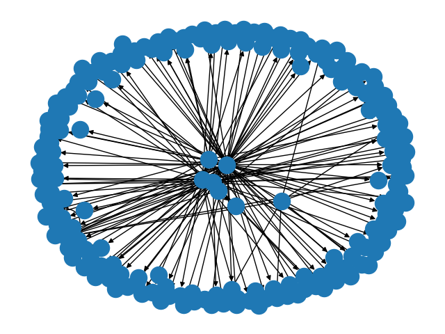
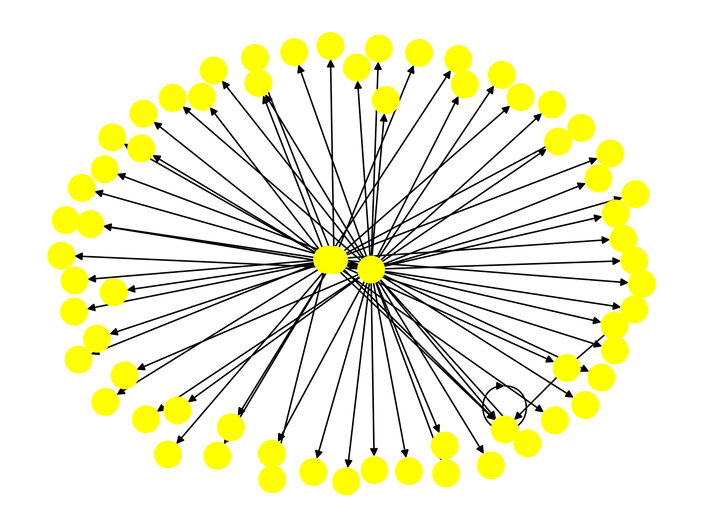

### This is a repository for making a parser framework for Darpa Theia Dataset

#### Progress so far
1. We have made a python file (graph_draw) that draws the first 500 nodes of the graph
2. We have a code subgraph.py which draws the subgraph of connected node from the big graph

***To run shell command*** **:** 
``` python helper/graph_draw.py ```

#### Here is a sample image of 50 nodes directed graph from darapa theia dataset


#### Here is a sample image of a subgraph consisting of 66 nodes from the parent graph dataset

